### 设计模式

#### 分类

##### 创建型模式（5）

- 工厂方法模式 ( Factory Method ) 
- 抽象工厂模式 ( Abstract Factory ) 
- 单例模式 ( Singleton ) 
- 建造者模式 ( Builder ) 
- 原型模式 ( Prototype ) 

##### 结构型模式（7）

- 适配器模式 ( Adapter ) 
- 装饰器模式 ( Decorator ) 
- 代理模式 ( Proxy ) 
- 外观模式 ( Facade ) 
- 桥接模式 ( Bridge ) 
- 组合模式 ( Composite ) 
- 享元模式 ( Flyweight ) 

##### 行为型模式（11）

- 策略模式 ( Strategy ) 
- 模板方法模式 ( Template Method ) 
- 观察者模式 ( Observer ) 
- 迭代器模式 ( Iterator ) 
- 责任链模式 ( Chain of Responsibility ) 
- 命令模式 ( Command ) 
- 备忘录模式 ( Memento ) 
- 中介者模式 ( Mediator ) 
- 解释器模式 ( Interpreter ) 
- 访问者模式 ( Visitor ) 
- 状态模式 ( State ) 

#### 七大原则

- 单一职责原则(Single Responsibility Principle)

  单一职责原则表示一个模块的组成元素之间的功能相关性。从软件变化的角度来看，就一个类而言，应该仅有一个让它变化的原因；通俗地说，即一个类只负责一项职责。

- 开闭原则（ Open Close principle ) 

  > 开闭原则就是说**对扩展开放，对修改关闭**。在程序需要进行拓展的时候，不能去修改原有的代码，实现一个热插拔的效果。所以一句话概括就是：为了使程序的扩展性好，易于维护和升级。想要达到这样的效果，我们需要使用接口和抽象类。

- 里氏替换原则 ( Liskov Substitution Principle ) 

  > 里氏代换原则(Liskov Substitution Principle LSP)面向对象设计的基本原则之一。 里氏代换原则中说，任何基类可以出现的地方，子类一定可以出现。 LSP 是继承复用的基石，只有当衍生类可以替换掉基类，软件单位的功能不受到影响时，基类才能真正被复用，而衍生类也能够在基类的基础上增加新的行为。里氏代换原则是对“开-闭”原则的补充。实现“开-闭”原则的关键步骤就是抽象化。而基类与子类的继承关系就是抽象化的具体实现，所以里氏代换原则是对实现抽象化的具体步骤的规范。

- 依赖倒转原则 ( Dependence Inversion Principle ) 

  这个是开闭原则的基础，具体内容：针对接口编程，依赖于抽象而不依赖于具体。

- 接口隔离原则 ( Interface Segregation Principle ) 

  这个原则的意思是：使用多个隔离的接口，比使用单个接口要好。还有一个降低类之间的耦合度的意思。

- 迪米特法则 （最少知道原则 )  ( Demeter Principle ) 

  一个实体应当尽量少的与其他实体之间发生相互作用，使系统功能模块相对独立。

- 合成复用原则 ( Composite Reuse Principle ) 

  尽量使用合成/聚合的方式，而不是使用继承。

#### 简单（4）
- 工厂方法  factory类->静态方法
- 抽象工厂  多个factory类 
- 单例      懒汉/饿汉/双重检查
- 建造者    builder

#### 有用的（12）
- 适配器 adapter
- 装饰器 decorator|wrapper
- 代理  proxy 静态代理|动态代理
- 外观 Facade
- 桥接 bridge
- 组合 composite
- 策略  strategy 
- 模板方法 template
- 观察者 observer
- 责任链 chain of responsibility
- 命令 command 
- 状态  state 

#### 很少使用（7）

- 原型 prototype
- 享元 flyweight
- 迭代器 iterator
- 备忘录 memento 
- 中介者 mediator 
- 解释器 interperter
- 访问者 visitor 

#### 工厂方法模式 ( Factory Method ) 

建立一个工厂类，对实现了同一接口的一些类进行实例的创建。

```java
public interface Sender {
    public void send();
}

public class MailSender implements Sender {
    @Override
    public void send() {
        //...
    }
}

public class SmsSender implements Sender {
    @Override
    public void send() {
        //...
    }
}

public class SendFactory {
    public static Sender produceMail() {
        return new MailSender();
    }

    public static Sender produceSms() {
        return new SmsSender();
    }
}

//test
SendFactory.produceMail().send();
```

##### Jdk中的工厂方法模式

- `java.lang.Proxy#newProxyInstance()`
- `java.lang.Object#toString()`
- `java.lang.Class#newInstance()`
- `java.lang.reflect.Array#newInstance()`
- `java.lang.reflect.Constructor#newInstance()`
- `java.lang.Boolean#valueOf(String)`
- `java.lang.Class#forName()`

##### Mybatis中的工厂方法模式

- `org.apache.ibatis.exceptions.ExceptionFactory`
- `org.apache.ibatis.logging.LogFactory`

#### 抽象工厂模式 ( Abstract Factory ) 

工厂方法模式的一个问题就是类的创建依赖工厂类，如果要拓展，则需要修改工厂类，违背了开闭原则。使用抽象工厂模式，创建多个工厂类，增加新功能，就直接增加新的工厂类就可以了。

```java
  public interface Provider {
    public Sender produce();
  }

  public class SmsSendFactory implements Provider {
    @Override
    public Sender produce() {
      return new SmsSender();
    }
  }

  public class MailSendFactory implements Provider {
    @Override
    public Sender produce() {
      return new MailSender();
    }
  }

  //test
  new MailSendFactory().produce().send();
  new SmsSendFactory().produce().send();
```

##### Jdk中的抽象工厂模式

- `java.util.Calendar#getInstance()
- `java.util.Arrays#asList()`
- `java.util.ResourceBundle#getBundle()`
- `java.sql.DriverManager#getConnection()`
- `java.sql.Connection#createStatement()`
- `java.sql.Statement#executeQuery()`
- `java.text.NumberFormat#getInstance()`
- `javax.xml.transform.TransformerFactory#newInstance()`

##### Mybatis中的抽象工厂模式

- `org.apache.ibatis.datasource.DataSourceFactory`

  `org.apache.ibatis.datasource.jndi.JndiDataSourceFactory`

  `org.apache.ibatis.datasource.pooled.PooledDataSourceFactory`

  `org.apache.ibatis.datasource.unpooled.UnpooledDataSourceFactory`

- `org.apache.ibatis.session.SqlSessionFactory`

  `org.apache.ibatis.session.defaults.DefaultSqlSessionFactory`
  
  ```java
  //DefaultSqlSessionFactory类
  private SqlSession openSessionFromDataSource(ExecutorType execType, TransactionIsolationLevel level, boolean autoCommit) {
      //...
      return new DefaultSqlSession(configuration, executor, autoCommit);
  }
  ```

#### 单例模式 ( Singleton ) 

```java
  //静态内部类保证调用getInstance()方法时才初始化，同时由jvm保证仅一次初始化
  public class SingleTon {
    private SingleTon() {
      //防止被实例化
    }
    private static class SingleTonFactory {
      private static SingleTon instance = new SingleTon();
    }
    
    public static SingleTon getInstance() {
      return SingleTonFactory.instance;
    }
    
    /* 如果该对象被用于序列化，可以保证对象在序列化前后保持一致 */
    public Object readResolve() {
      return getInstance();
    }
  }
```
```java
  //双重校验加volatile，保证jdk5以后不出现指令重排
  public class SingleTon {
    private volatile static SingleTon instance;
    private SingleTon() {
      
    }
    public static SingleTon getInstance() {
      if(instance == null) {
        synchronized (SingleTon.class) {
          if(instance == null) {
            instance = new SingleTon();
          }
        }
      }
      return instance;
    }
  }
```

<!-- more -->

##### Jdk中的单例模式

- `java.lang.Runtime#getRuntime()`
- `java.awt.Toolkit#getDefaultToolkit()`
- `java.awt.GraphicsEnvironment#getLocalGraphicsEnvironment()`
- `java.awt.Desktop#getDesktop()`

#### 建造者模式（ Builder ) 

使用多个简单的步骤来一步一步构建成一个复杂的对象。

```java
  public class MultiSender {
    private List<Sender> senderList;
    
    public MultiSender() {
      this(10);
    }
    
    public MultiSender(int size) {
      senderList = new ArrayList<>(size);
    }
    
    public List<Sender> getSenderList() {
      return senderList;
    }
    
    public static class Builder {
    	private List<MailSender> mailSenders = null;
      private List<SmsSender> smsSenders = null;
      public Builder() {
        this(10);
      }
      
      public Builder(int size) {
        mailSenders = new ArrayList<>(size);
        smsSenders = new ArrayList<>(size);
      }
      
      public Builder addMailSender(MailSender mailSender) {
        mailSenders.add(mailSender); 
        return this;
    	}
      
      public Builder addSmsSender(SmsSender smsSender) {
        smsSenders.add(smsSender);
        return this;
      }
      
      public Builder addSender(Sender sender) {
        if(sender instanceof MailSender) {
          this.addMailSender((MailSender)sender);
        } else if(sender instanceof SmsSender) {
          this.addSmsSender((SmsSender)sender);
        }
        return this;
      }
      
      public MultiSender build() {
        int size = mailSenders.size() + smsSenders.size();
        MultiSender sender = new MultiSender(size);
        List<Sender> senderList = sender.getSenderList();
        senderList.addAll(mailSenders);
        senderList.addAll(smsSenders);
        return sender;
      }
    }
  }

  public class SenderTest {
    public static void main(String[] args) {
      MultiSender.Builder build = new MultiSender.Builder();
      build.addSmsSender(new SmsSender()).addMailSener(new MailSender());
      MultiSender sender = build.build();
      List<Sender> senders = sender.getSenderList();
      for(Sender sender : senders) {
        sender.send();
      }
    }
  }
```

##### Jdk中的建造模式

- `java.lang.StringBuilder#append()`
- `java.lang.StringBuffer#append()`
- `java.sql.PreparedStatement`
- `javax.swing.GroupLayout.Group#addComponent()`

##### Mybatis中建造模式

- `org.apache.ibatis.mapping.CacheBuilder`
- `org.apache.ibatis.jdbc.SqlBuilder`
- `org.apache.ibatis.session.SqlSessionFactoryBuilder`

#### 适配器模式（ Adapter ) 

适配器模式将某个类的接口转换成客户端期望的另一个接口表示，目的是消除由于接口不匹配所造成的类的兼容性问题。

##### 角色

- Target

  目标角色，期待得到的接口

- Adaptee

  适配者角色，被适配的接口

- Adapter

  适配器角色，将源接口转换成目标接口

主要分为二类：类的适配器模式、对象的适配器模式。 

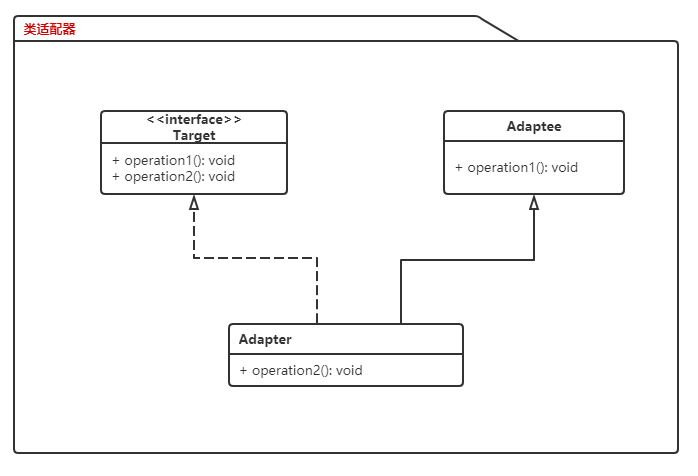

- 类的适配器模式

  ```java
  public class Adaptee {
      public void method1() {
          System.out.println("this is original method!");
      }
  }
  
  public interface Targetable {
      public void method1();
      public void method2();
  }
  
  public class Adapter extends Adaptee implements Targetable {
      @Override
      public void method2() {
          System.out.println("this is the targetable method!");
      }
  }
  
  public class AdapterTest {
      public static void main(String[] args) {
          Targetable  target = new Adapter();
          target.method1();
          target.method2();
      }
  }
  //this is original method!
  //this is the targetable method!
  ```

  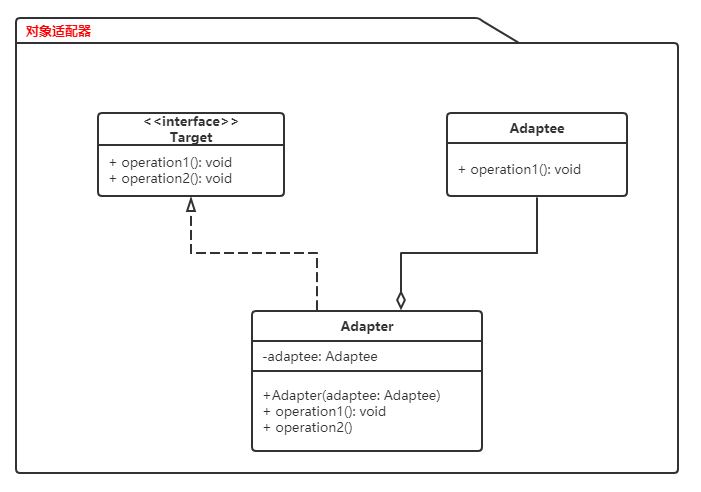

- 对象的适配器模式

  基本思路和类的适配器模式相同，只是将 Adapter 类作修改，这次不继承 Source 类，而是持有 Source 类的实例，以达到解决兼容性的问题。

  ```java
  public class Target implements Targetable {
      private Adaptee adaptee;
  
      public Target(Adaptee adaptee) {
          super();
          this.adaptee = adaptee;
      }
  
      @Override
      public void method2() {
          System.out.println("this is the targetable method!");  
      }
  
      @Override
      public void method1() {
          adaptee.method1();
      }
  }
  
  public class AdapterTest {
      public static void main(String[] args) {
          Adaptee adaptee = new Adaptee();
          Targetable target = new Target(adaptee);
          target.method1();
          target.method2();
      }
  }
  //this is original method!
  //this is the targetable method!
  ```

##### Jdk中的适配器模式

- `java.util.Arrays#asList()`
- `javax.swing.JTable(TableModel)`
- `java.io.InputStreamReader(InputStream)`
- `java.io.OutputStreamWriter(OutputStream)`
- `javax.xml.bind.annotation.adapters.XmlAdapter#marshal()`
- `javax.xml.bind.annotation.adapters.XmlAdapter#unmarshal()`

##### Mybatis中的适配器模式

将市场的各种日志插件，转换为MyBatis的日志接口，统一使用。

Target：接口Log就是要转化的目标接口

Adapter：各个子包下的实现类，就是适配器

Adaptee：各个日志框架的日志类，比如org.apache.log4j.Logger就是需要适配的类

- `org.apache.ibatis.logging.Log`

  `org.apache.ibatis.logging.slf4j.Slf4jImpl`

  `org.apache.ibatis.logging.log4j.Log4jImpl`

#### 装饰模式（ Decorator ) 

装饰模式是指给一个对象增加一些新的功能，而且是动态的，要求装饰对象和被装饰对象实现同一个接口，装饰对象持有被装饰对象的实例。Java IO中的类就是运用了装饰模式，如

```java
FileReader f = new FileReader(filename);
BufferedReader b = new FileReader(f);
```

```java
FileInputStream f = new FileInputStream(new File(filename));
BufferedInputStream bi = new BufferedInputStream(f);
```

##### 角色

- **Component**: 被装饰对象接口
- **ConcreteComponent**: 被装饰对象实现类
- **Decorator**: 抽象装饰类
- **ConcreteDecorator**: 具体装饰类

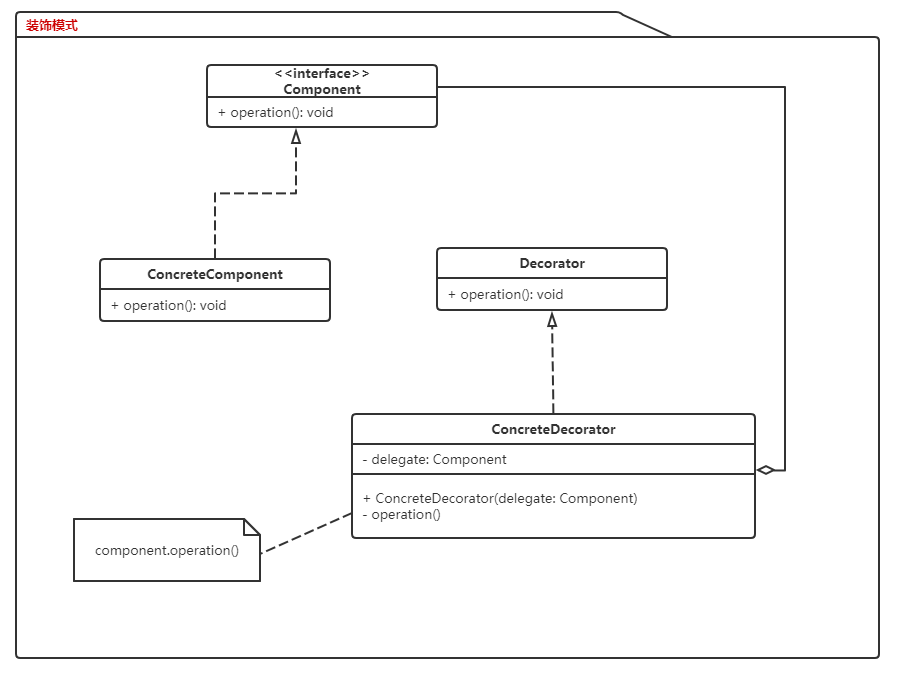

```java
public interface Sourceable {
    public void method();
}

public class Source implements Sourceable {
    @Override
    public void method() {
        System.out.println("the original method!");
    }
}

public class Decorator implements Sourceable {
    private Sourceable source;

    public Decorator(Sourceable source) {
        super();
        this.source = source;
    }

    @Override
    public void method() {
        System.out.println("before decorator!");
        source.method();
        System.out.println("after decorator!");
    }
}

public class DecoratorTest {

    public static void main(String[] args) {
        Sourceable source = new Source();
        Sourceable obj = new Decorator(source);
        obj.method();
    }
}
//before decorator!
//the original method!
//after decorator!
```

装饰模式和适配器模式有很多的区别：

  装饰模式：不需要知道`被装饰对象`的实现详情，主要是动态添加新的功能。

  适配器模式：需要知道`被适配对象`的实现详情，主要是转化为目标对象需要的接口。

##### Jdk中的装饰器模式

- `java.io.BufferedInputStream(InputStream)`
- `java.io.DataInputStream(InputStream)`
- `java.io.BufferedOutputStream(OutputStream)`
- `java.util.zip.ZipOutputStream(OutputStream)`
- `java.util.Collections#checked[List|Map|Set|SortedSet|SortedMap]`

##### Mybatis中的装饰器模式

- `org.apache.ibatis.cache.Cache`

  `org.apache.ibatis.cache.impl.PerpetualCache`

  `org.apache.ibatis.cache.decorators.FifoCache`

#### 代理模式 ( Proxy ) 

  代理模式就是多一个代理类出来，替原对象进行一些操作。分为静态代理、动态代理(包括JDK动态代理、cglib代理、Javassist、ASM库)。

##### 角色

- 抽象主题（**Subject**）类：通过接口或抽象类声明真实主题和代理对象实现的业务方法。
- 真实主题（**Real Subject**）类：实现了抽象主题中的具体业务，是代理对象所代表的真实对象，是最终要引用的对象。
- 代理（**Proxy**）类：提供了与真实主题相同的接口，其内部含有对真实主题的引用，它可以访问、控制或扩展真实主题的功能。

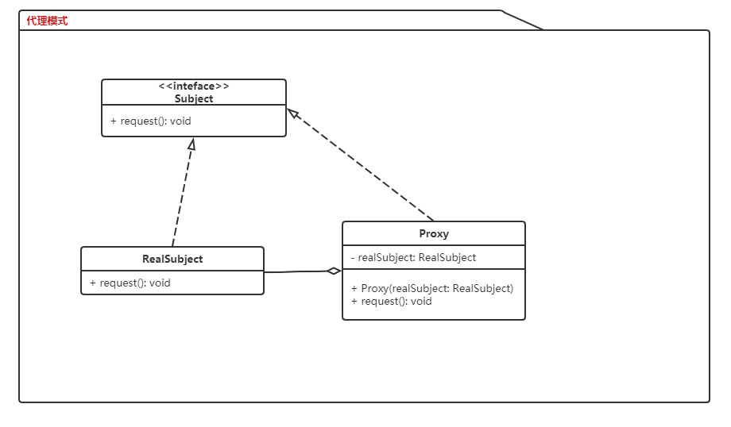

##### 静态代理

```java
package proxy;

public class ProxyTest {
    public static void main(String[] args) {
        Proxy proxy = new Proxy();
        proxy.Request();
    }
}

//抽象主题
interface Subject {
    void request();
}

//真实主题
class RealSubject implements Subject {
    public void request() {
        System.out.println("访问真实主题方法...");
    }
}

//代理
class Proxy implements Subject {
    private RealSubject realSubject;

    @Override
    public void request() {
        if (realSubject == null) {
            realSubject = new RealSubject();
        }
        preRequest();
        realSubject.request();
        postRequest();
    }

    public void preRequest() {
        System.out.println("访问真实主题之前的预处理。");
    }

    public void postRequest() {
        System.out.println("访问真实主题之后的后续处理。");
    }
}
```

##### jdk动态代理

```java
public class DemoProxyHandler implements InvocationHandler {
    private Object target;

    public DemoProxyHandler(Object target) {
        this.target = target;
    }

    @Override
    public Object invoke(Object proxy, Method method, Object[] args) throws Throwable {
        if (method.getName().equals("equals")) {
            // Only consider equal when proxies are identical.
            return (proxy == args[0]);
        } else if (method.getName().equals("hashCode")) {
            // Use hashCode of Connection proxy.
            return System.identityHashCode(proxy);
        } else if (method.getName().equals("close")) {
            // Handle close method: don't pass the call on.
            return null;
        }
        try {
            return method.invoke(this.target, args);
        } catch (InvocationTargetException ex) {
            throw ex.getTargetException();
        }
    }
}

//调用
Subject target = new RealSubject();
DemoProxyHandler proxyHandler = new DemoProxyHandler(target);

DemoInterface proxy = (DemoInterface) Proxy.newProxyInstance(Subject.class.getClassLoader(), new Class[]{Subject.class}, proxyHandler);
```

装饰模式 ( Decorator )  与代理模式 ( Proxy ) 模式的区别

  装饰模式：`被装饰对象`对客户端透明，用于增强`被装饰对象`的功能。

  代理模式：`被代理对象`对客户端不透明，用于控制`被代理对象`的引用，起到限制作用。

##### Jdk中的代理模式

- java.lang.reflect.Proxy
- RMI

##### Mybatis中的代理模式

- `org.apache.ibatis.binding.MapperProxyFactory`

- `org.apache.ibatis.binding.MapperProxy`

#### 外观模式 ( Facade )

  > 外观模式是为了解决类与类之间的依赖关系的，像 Spring 一样，可以将类和类之间的关系配置到配置文件中，而外观模式就是将他们的关系放在一个 Facade 类中，降低了类类之间的耦合度，该模式中没有涉及到接口

##### 角色

- 外观（**Facade**）角色：为多个子系统对外提供一个共同的接口。
- 子系统（**Sub System**）角色：实现系统的部分功能，客户可以通过外观角色访问它。 

外观模式 ( Facade )  与装饰模式 ( Decorator ) 模式的区别

  外观模式：一般针对一群类。

  装饰模式：`被装饰对象`一般是单个类。

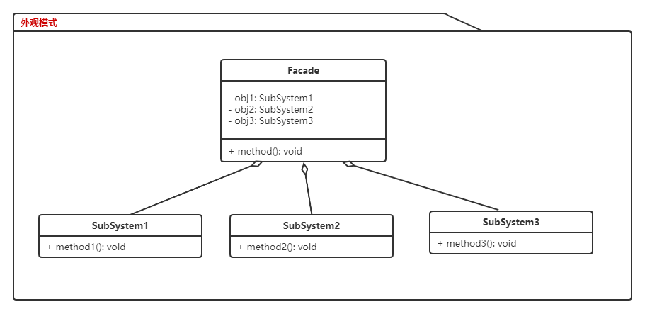

##### Jdk中的外观模式

给一组组件，接口，抽象，或者子系统提供一个简单的接口。

- java.lang.Class
- javax.faces.webapp.FacesServlet

##### Mybatis中的外观模式

- `org.apache.ibatis.reflection.MetaObject`

  `org.apache.ibatis.sessio.Configuration`


#### 桥接模式（ Bridge ) 

桥接模式就是把事物和其具体实现分开，使他们可以各自独立的变化。桥接的用意是：将抽象化与实现化解耦，使得二者可以独立变化。

##### 角色

- 抽象化（**Abstraction**）角色：定义抽象类，并包含一个对实现化对象的引用。
- 扩展抽象化（**Refined Abstraction**）角色：是抽象化角色的子类，实现父类中的业务方法，并通过组合关系调用实现化角色中的业务方法。
- 实现化（**Implementor**）角色：定义实现化角色的接口，供扩展抽象化角色调用。被桥接对象的接口。
- 具体实现化（**Concrete Implementor**）角色：给出实现化角色接口的具体实现。实际被桥接的对象。

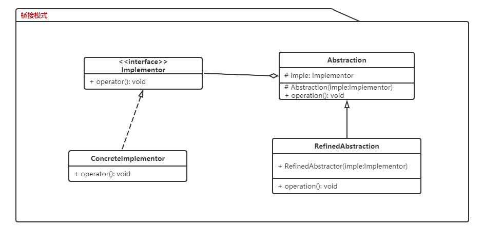

##### Jdk中的桥接模式

- AWT
- JDBC

桥接模式与装饰模式的区别：

装饰模式：给被装饰的对象动态地添加一些额外功能，适应新需求而添加新功能，不影响被装饰的对象

桥接模式：适应变化维度的一种模式，它在于将对象的各个维度的变化都独立开来，使一些变化不受其他因素变化的影响，被桥接对象自身有沿着多个维度变化的趋势 , 本身不稳定

##### Mybatis 中的桥接模式

- `org.apache.ibatis.executor.Executor`

  `org.apache.ibatis.executor.BaseExecutor`

  `org.apache.ibatis.executor.CachingExecutor`

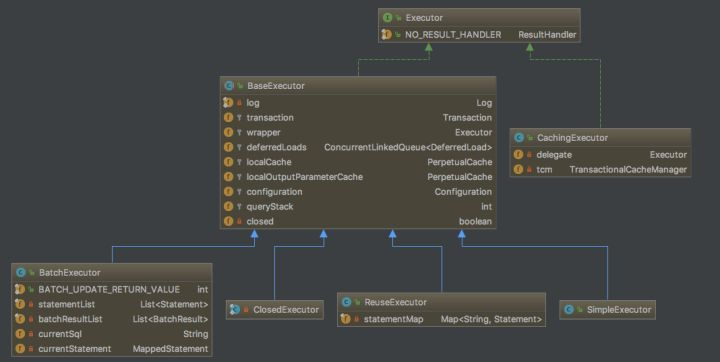

#### 组合模式 ( Composite ) 

组合模式有时又叫**部分**-**整体**模式，在处理类似树形结构的问题时比较方便。

使得客户端看来单个对象和对象的组合是同等的。换句话说，某个类型的方法同时也接受自身类型作为参数。

##### 角色

- **组件** （**Component**） 接口描述了树中简单项目和复杂项目所共有的操作，是组合中对象声明接口，实现所有类共有接口的默认行为。
- **叶节点** （**Leaf**） 是树的基本结构， 它不包含子项目。
- **容器** （Container）——又名 “组合 （**Composite**）”——是包含叶节点或其他容器等子项目的单位。 容器不知道其子项目所属的具体类， 它只通过通用的组件接口与其子项目交互。.

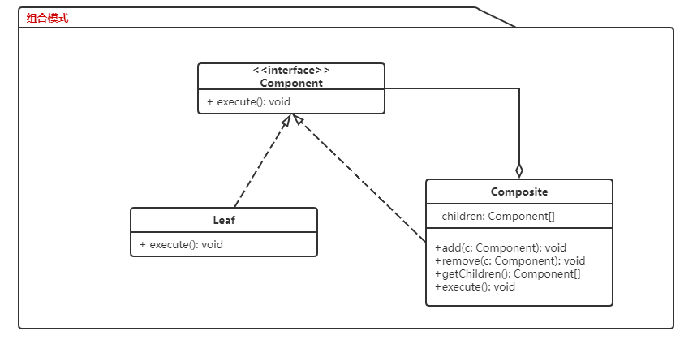


```java
  private class TreeNode {
    private String name;
    private TreeNode parent;
    private Vector<TreeNode> children;
    
    public TreeNode(String name) {
      this.name = name;
    }
    
    public void add(TreeNode node) {
      children.add(node);
    }
    
    public void remove(TreeNode node) {
      children.remove(node);
    }
    
    public Enumeration<TreeNode> getChildren() {
      return child.elements();
    }
  }

  public class Tree {
    TreeNode root = null;
    public Tree(String name) {
      root = new TreeNode(name);
    }
    public static void main(String[] args) {  
      Tree tree = new Tree("A");  
      TreeNode nodeB = new TreeNode("B");  
      TreeNode nodeC = new TreeNode("C");  

      nodeB.add(nodeC);  
      tree.root.add(nodeB);  
      System.out.println("build the tree finished!");  
    }
  }
```

##### Jdk中的组合模式

- `javax.swing.JComponent#add(Component)`
- `java.awt.Container#add(Component)`
- `java.util.Map#putAll(Map)`
- `java.util.List#addAll(Collection)`
- `java.util.Set#addAll(Collection)`

##### Mybatis中的组合模式

参见[mybatis动态sql之组合模式](http://870314.com/2019/11/02/mybatis%E5%8A%A8%E6%80%81sql%E5%AE%9E%E7%8E%B0%E4%B9%8B%E7%BB%84%E5%90%88%E6%A8%A1%E5%BC%8F/)

- `org.apache.ibatis.scripting.xmltags.SqlNode`

  `org.apache.ibatis.scripting.xmltags.TrimSqlNode`

  `org.apache.ibatis.scripting.xmltags.MixedSqlNode`

##### 模式之间的关系与区别

- **桥接模式**通常是会于开发前期进行设计，使你能够将程序的各个部分独立开来以便开发。**适配器模式**通常在已有程序中使用，以使相互不兼容的类可以很好地协同工作。
- **适配器模式**可以对已有对象的接口进行修改，**装饰模式**则能在不改变对象接口的前提下强化对象功能。
- **适配器模式**能为被封装对象提供不同的接口，**代理模式**能为对象提供相同的接口，**装饰模式**则能为对象提供加强的接口。
- **外观模式**为现有对象定义了一个新接口，**适配器模式**则会试图运用已有的接口。适配器通常只封装一个对象，外观通常会作用于整个对象子系统上。
- **桥接**、 **状态模式**和**策略模式** （在某种程度上包括**适配器**） 模式的接口非常相似。 实际上，它们都基于**组合模式**——即将工作委派给其他对象， 不过也各自解决了不同的问题。 

#### 策略模式（ Strategy ) 

策略模式定义了一系列算法，并将每个算法封装起来，使他们可以相互替换，且算法的变化不会影响到使用算法的客户。需要设计一个接口，为一系列实现类提供统一的方法，多个实现类实现该接口，设计一个抽象类（可有可无，属于辅助类），提供辅助函数。

##### 角色

- **Context**: 环境类
- **Strategy**: 抽象策略类
- **ConcreteStrategy**: 具体策略类

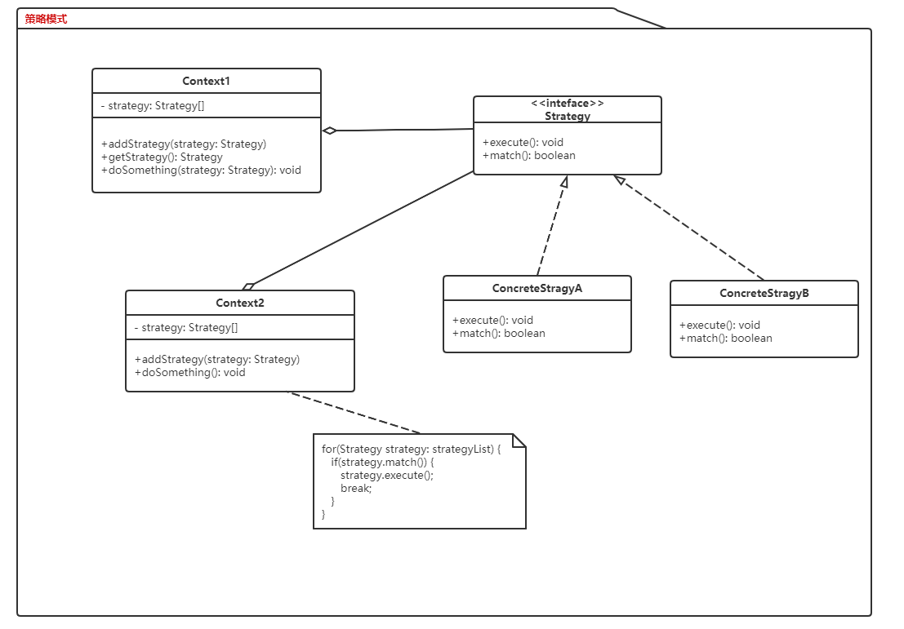

##### Jdk中的策略模式

使用这个模式来将一组算法封装成一系列对象。通过传递这些对象可以灵活的改变程序的功能。

- `java.util.Comparator#compare()`
- `javax.servlet.http.HttpServlet`
- `javax.servlet.Filter#doFilter()`

##### Mybatis中的策略模式

- `org.apache.ibatis.session.Configuration.newExecutor(Transaction)`

  `org.apache.ibatis.executor.Executor`

  `org.apache.ibatis.executor.BatchExecutor`

  `org.apache.ibatis.executor.SimpleExecutor`

  `org.apache.ibatis.executor.ReuseExecutor`


#### 模板方法模式（ Template Method ) 

  模板方法模式是指一个抽象类中，有一个主方法，再定义1到n个方法，可以是抽象的，也可以是实际方法，定义一个类，继承该抽象类，重写抽象方法。通过调用抽象类，实现对子类的调用。

##### 角色

- **抽象类** （**Abstract­Class**） 会声明作为算法步骤的方法， 以及依次调用它们的实际模板方法。 算法步骤可以被声明为 `抽象`类型， 也可以提供一些默认实现。
- **具体类** （**Concrete­Class**） 可以重写所有步骤， 但不能重写模板方法自身。

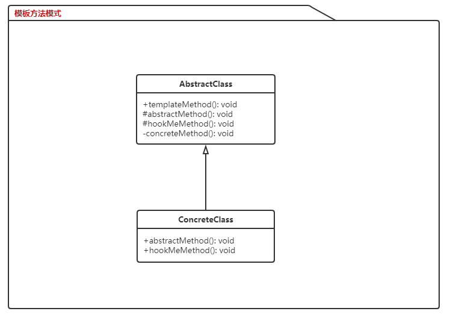

##### Jdk中的模板方法模式

让子类可以重写方法的一部分，而不是整个重写，你可以控制子类需要重写那些操作。

- `java.util.Collections#sort()`
- `java.io.InputStream#skip()`
- `java.io.InputStream#read()`
- `java.util.AbstractList#indexOf()`

##### Mybatis中的模板方法模式

- `org.apache.ibatis.executor.Executor`

  `org.apache.ibatis.executor.BaseExecutor`

  `org.apache.ibatis.executor.BatchExecutor`

  `org.apache.ibatis.executor.SimpleExecutor`

  `org.apache.ibatis.executor.ReuseExecutor`


#### 观察者模式（ Observer ) 

观察者模式很好理解，类似于邮件订阅和RSS订阅，当我们浏览一些博客或wiki时，经常会看到RSS图标，就这的意思是，当你订阅了该文章，如果后续有更新，会及时通知你。其实，简单来讲就一句话：当一个对象变化时，其它依赖该对象的对象都会收到通知，并且随着变化！对象之间是一种一对多的关系。

##### 角色

- 抽象主题（**Subject**）角色：也叫抽象目标类，它提供了一个用于保存观察者对象的聚集类和增加、删除观察者对象的方法，以及通知所有观察者的抽象方法。
- 具体主题（**Concrete Subject**）角色：也叫具体目标类，它实现抽象目标中的通知方法，当具体主题的内部状态发生改变时，通知所有注册过的观察者对象。
- 抽象观察者（**Observer**）角色：它是一个抽象类或接口，它包含了一个更新自己的抽象方法，当接到具体主题的更改通知时被调用。
- 具体观察者（**Concrete Observer**）角色：实现抽象观察者中定义的抽象方法，以便在得到目标的更改通知时更新自身的状态。

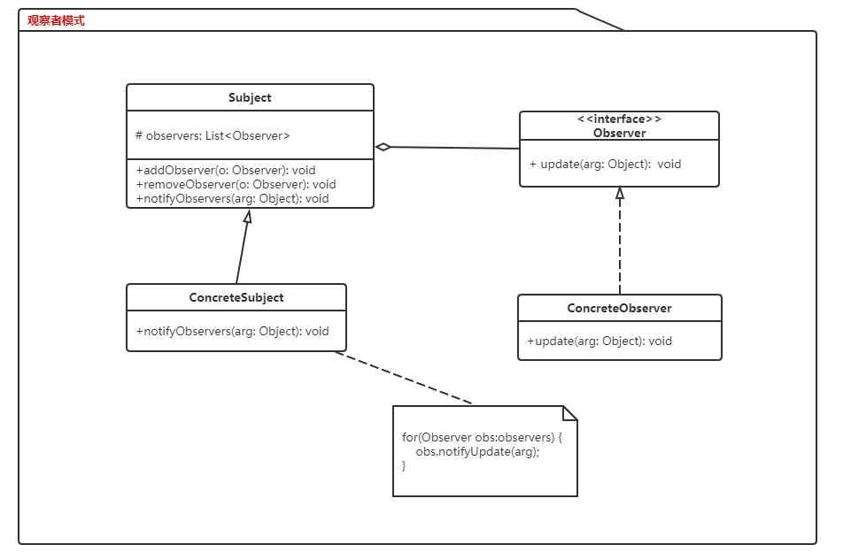

```java
public interface Observer {
    void update(Object arg);
}

public interface Observable {
	void addObserver(Observer o);
    
    void removeObserver(Observer o);
    
    void notifyObservers(Object arg);
}

public class Subject implements Observable {
    private List<Observer> obs = new ArrayList<>();
    
    @Override
    void addObserver(Observer o) {
        if (!obs.contains(o)) {
            obs.add(o);
        }
    }
    
    @Override
    void removeObserver(Observer o) {
        if(obs.contains(o)){
            obs.remove(o);
        }
    }
    
    @Override
    void notifyObservers(Object arg) {
        for (Observer o : obs) {
            o.update(arg);
        }
    }
    
    @Override
    void asyncNotifyObservers(Object arg) {
        for (Observer o : obs) {
            executor.submit(() -> o.update(arg));
        }
    }
}
```

##### Jdk中的观察者模式

- `java.util.EventListener`
- `javax.servlet.http.HttpSessionBindingListener`
- `javax.servlet.http.HttpSessionAttributeListener`
- `javax.faces.event.PhaseListener`

##### Spring中的观察者模式

- `org.springframework.context.ApplicationListener `
- `org.springframework.context.event.ApplicationEventMulticaster`

#### 责任链模式 ( Chain of Responsibility )

责任链模式，有多个对象，每个对象持有对下一个对象的引用，这样就会形成一条链，请求在这条链上传递，直到某一对象决定处理该请求。但是发出者并不清楚到底最终那个对象会处理该请求，所以，责任链模式可以实现，在隐瞒客户端的情况下，对系统进行动态的调整。

##### 角色

- 抽象处理者（**Handler**）角色：定义一个处理请求的接口，包含抽象处理方法和一个后继连接。
- 具体处理者（**Concrete Handler**）角色：实现抽象处理者的处理方法，判断能否处理本次请求，如果可以处理请求则处理，否则将该请求转给它的后继者。

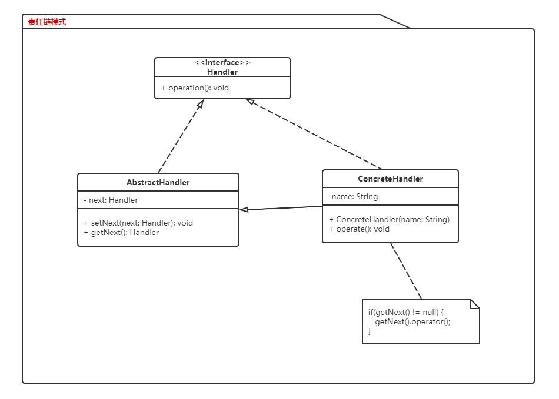

```java
public interface Handler {
    public void operator();  
}

public abstract class AbstractHandler {
    private Handler next;
    public Handler getNext() {
        return handler;
    }
    public void setNext(Handler handler) {
        this.handler = handler;
    }
}

public class ConcreteHandler extends AbstractHandler implements Handler {
    private String name;
    public ConcreteHandler(String name) {
        this.name = name;
    }

    @Override
    public void operator() {
        System.out.println(name + " deal!");
        if (getNext() != null) {
            getNext().operator();
        }
    }
}

public class Test {

    public static void main(String[] args) {
        ConcreteHandler h1 = new ConcreteHandler("h1");
        ConcreteHandler h2 = new ConcreteHandler("h2");
        ConcreteHandler h3 = new ConcreteHandler("h3");

        h1.setNext(h2);
        h2.setNext(h3);

        h1.operator();
    }
}
```

##### Jdk中的责任链模式

- `java.util.logging.Logger#log()`
- `javax.servlet.Filter#doFilter()`

##### Mybatis中的责任链模式

- `org.apache.ibatis.plugin.InterceptorChain`

  `org.apache.ibatis.session.Configuration.addInterceptor()`

#### 命令模式  ( Command )

命令模式很好理解，举个例子，司令员下令让士兵去干件事情，从整个事情的角度来考虑，司令员的作用是，发出口令，口令经过传递，传到了士兵耳朵里，士兵去执行。这个过程好在，三者相互解耦，任何一方都不用去依赖其他人，只需要做好自己的事儿就行，司令员要的是结果，不会去关注到底士兵是怎么实现的。

##### 角色

- 抽象命令类（**Command**）角色：声明执行命令的接口，拥有执行命令的抽象方法 execute()。
- 具体命令类（**Concrete Command**）角色：是抽象命令类的具体实现类，它拥有接收者对象，并通过调用接收者的功能来完成命令要执行的操作。
- 实现者/接收者（**Receiver**）角色：执行命令功能的相关操作，是具体命令对象业务的真正实现者。
- 调用者/请求者（**Invoker**）角色：是请求的发送者，它通常拥有很多的命令对象，并通过访问命令对象来执行相关请求，它不直接访问接收者。

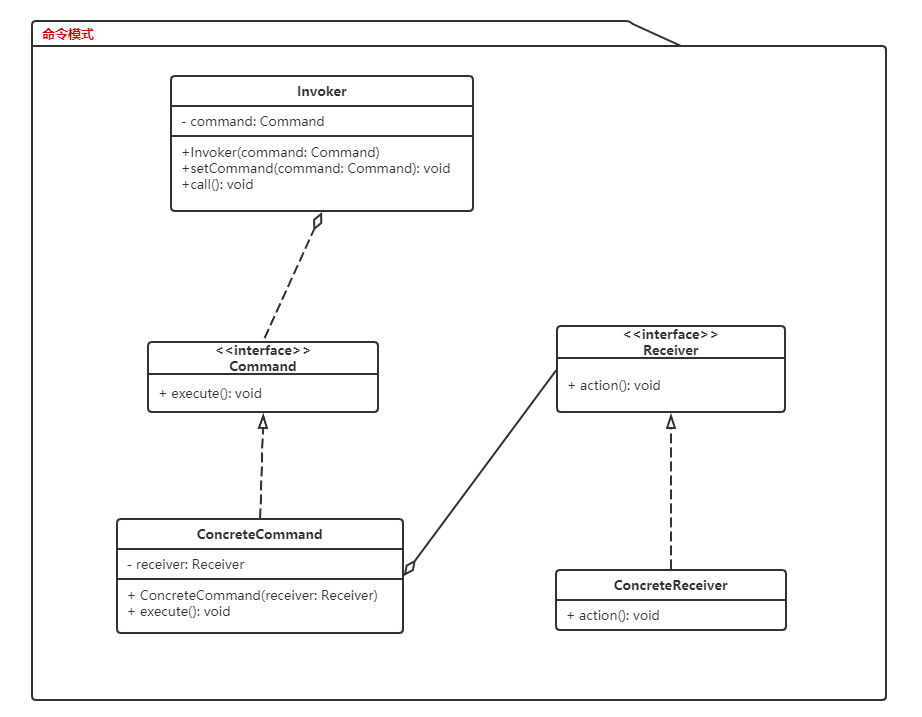

```java
public interface Command<T> {
    T execute();
}

public class CommandImpl<T> implements Command<T> {
    private Receiver<T> receiver;
    public CommandImpl(Receiver receiver) {
        this.receiver = receiver;
    }

    @Override
    public T execute() {
        return receiver.execute();
    }
}

public class CommandInvoker<T> {
    private Command<T> command;

    //构造注入
    CommandInvoker(Command<T> command) {
        this.command = command;
    }

    //设值注入
    public void setCommand(Command<T> command) {
        this.command = command;
    }

    //业务方法，用于调用命令类的execute()方法
    public T call() {
        return command.execute();
    }
}

public interface Receiver<T> {
    T execute();
}

public class AddReceiver implements Receiver<Integer> {
    private int num1, num2;

    public AddReceiver(int num1, int num2) {
        this.num1 = num1;
        this.num2 = num2;
    }

    @Override
    public Integer execute() {
        return num1 + num2;
    }
}

public class CommandTest {
    public static void main(String[] args) {
        Receiver<Integer> receiver = new AddReceiver(1, 2);
        Command<Integer> command = new CommandImpl<>(receiver);

        CommandInvoker<Integer> invoker = new CommandInvoker<>(command);
        int result = invoker.call();
        System.out.println(result);
    }
}
```

##### Jdk中的命令模式

- `java.lang.Runnable`
- `javax.swing.Action`

##### Activiti中的命令模式(与责任链模式)

- `org.activiti.engine.impl.interceptor.CommandInvoker`

  `org.activiti.engine.impl.interceptor.Command`

  `org.activiti.engine.impl.cfg.ProcessEngineConfigurationImpl.initCommandExecutors()`

#### 状态模式（ State )

当对象的状态改变时，同时改变其行为。

##### 角色

- 环境类（**Context**）角色：也称为上下文，它定义了客户端需要的接口，内部维护一个当前状态，并负责具体状态的切换。
- 抽象状态（**State**）角色：定义一个接口，用以封装环境对象中的特定状态所对应的行为，可以有一个或多个行为。
- 具体状态（**Concrete State**）角色：实现抽象状态所对应的行为，并且在需要的情况下进行状态切换。

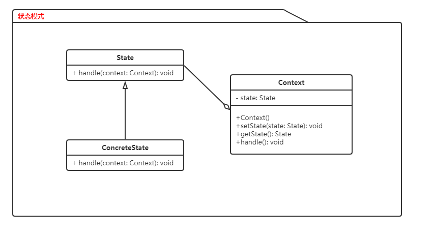

```java
abstract class State {
    //声明抽象业务方法，不同的具体状态类可以不同的实现  
    public abstract void handle();  
}

class ConcreteState extends State {
    public void handle() {
        //方法具体实现代码  
    }
}

class Context {
    private State state; //维持一个对抽象状态对象的引用  
    private int value; //其他属性值，该属性值的变化可能会导致对象状态发生变化  

     //定义环境类的初始状态
    public Context() {
        this.state = new ConcreteState();
    }
    
    //设置状态对象  
    public void setState(State state) {
        this.state = state;  
    }

    public void request() {
        //其他代码  
        state.handle(); //调用状态对象的业务方法  
        //其他代码  
    }
    
    public State checkState() {
        if(value == 1) {
            this.state = new State1();
        } else if(value ==2) {
            this.state == new State2();
        }
        return this.state;
    }
}
```

- Jdk中的状态模式

  通过改变对象内部的状态，使得你可以在运行时动态改变一个对象的行为。

  - `java.util.Iterator`
  - `javax.faces.lifecycle.LifeCycle#execute()`
  
- Spring StateMachine 状态机

#### 原型模式（ Prototype ) 

原型模式虽然是创建型的模式，但是与工程模式没有关系，从名字即可看出，该模式的思想就是将一个对象作为原型，对其进行复制、克隆，产生一个和原对象类似的新对象。在 Java 中，复制对象是通过 `clone()` 实现的。

```java
  public class Prototype implements Cloneable {
    public Object clone() throws CloneNotSupportedException {
      Prototype proto = (Prototype) super.clone();
      return proto;
    }
  }
```

**浅复制**：将一个对象复制后，基本数据类型的变量都会重新创建，而引用类型，指向的还是原对象所指向的。
**深复制**：将一个对象复制后，不论是基本数据类型还是引用类型，都是重新创建的。简单来说，就是深复制进行了完全彻底的复制，而浅复制不彻底。

```java
  public class Prototype implements Cloneable, Serializable {

    private static final long serialVersionUID = 1L;
    private String string;

    private SerializableObject obj;

    /* 浅复制 */
    public Object clone() throws CloneNotSupportedException {
      Prototype proto = (Prototype) super.clone();
      return proto;
    }

    /* 深复制 */
    public Object deepClone() throws IOException, ClassNotFoundException {

      /* 写入当前对象的二进制流 */
      ByteArrayOutputStream bos = new ByteArrayOutputStream();
      ObjectOutputStream oos = new ObjectOutputStream(bos);
      oos.writeObject(this);

      /* 读出二进制流产生的新对象 */
      ByteArrayInputStream bis = new ByteArrayInputStream(bos.toByteArray());
      ObjectInputStream ois = new ObjectInputStream(bis);
      return ois.readObject();
    }

    public String getString() {
      return string;
    }

    public void setString(String string) {
      this.string = string;
    }

    public SerializableObject getObj() {
      return obj;
    }

    public void setObj(SerializableObject obj) {
      this.obj = obj;
    }

  }

  class SerializableObject implements Serializable {
    private static final long serialVersionUID = 1L;
  }
```

##### Jdk中的原型模式

- `java.lang.Object#clone()`
- `java.lang.Cloneable`

#### 享元模式（ Flyweight ) 

享元模式的主要目的是实现对象的共享，即共享池，当系统中对象多的时候可以减少内存的开销，通常与工厂模式一起使用。

##### Jdk中的享元模式

使用缓存来加速大量小对象的访问时间。

- `java.lang.Integer#valueOf(int)`
- `java.lang.Boolean#valueOf(boolean)`
- `java.lang.Byte#valueOf(byte)`
- `java.lang.Character#valueOf(char)`

#### 迭代子模式  ( Iterator )

顾名思义，迭代器模式就是顺序访问聚集中的对象，一般来说，集合中非常常见，如果对集合类比较熟悉的话，理解本模式会十分轻松。这句话包含两层意思：一是需要遍历的对象，即聚集对象，二是迭代器对象，用于对聚集对象进行遍历访问。

##### Jdk中的迭代子模式

提供一个一致的方法来顺序访问集合中的对象，这个方法与底层的集合的具体实现无关。

  - `java.util.Iterator`
  - `java.util.Enumeration`

##### Mybatis中的迭代子模式

- `org.apache.ibatis.reflection.property.PropertyTokenizer`


#### 备忘录模式  ( Memento )

主要目的是保存一个对象的某个状态，以便在适当的时候恢复对象。

##### Jdk中的备忘录模式

生成对象状态的一个快照，以便对象可以恢复原始状态而不用暴露自身的内容。Date对象通过自身内部的一个long值来实现备忘录模式。

- java.util.Date
- java.io.Serializable

#### 中介者模式  ( Mediator )

用一个中介对象来封装一系列的对象交互。中介者使各对象不需要显式地相互引用，从而使其耦合松散，而且可以独立地改变它们之间的交互。

##### Jdk中的中介者模式

通过使用一个中间对象来进行消息分发以及减少类之间的直接依赖。

- `java.util.Timer`
- `java.util.concurrent.Executor#execute()`
- `java.util.concurrent.ExecutorService#submit()`
- `java.lang.reflect.Method#invoke()`


#### 解释器模式  ( Interpreter )

给定一种语言，定义他的文法的一种表示，并定义一个解释器，该解释器使用该表示来解释语言中句子。

解释器模式是一个比较少用的模式。

##### Jdk中的解释器模式

这个模式通常定义了一个语言的语法，然后解析相应语法的语句。

- `java.util.Pattern`
- `java.text.Normalizer`
- `java.text.Format`

#### 访问者模式 ( Visitor ) 

访问者模式把数据结构和作用于结构上的操作解耦合，使得操作集合可相对自由地演化。访问者模式适用于数据结构相对稳定算法又易变化的系统。因为访问者模式使得算法操作增加变得容易。若系统数据结构对象易于变化，经常有新的数据对象增加进来，则不适合使用访问者模式。访问者模式的优点是增加操作很容易，因为增加操作意味着增加新的访问者。访问者模式将有关行为集中到一个访问者对象中，其改变不影响系统数据结构。其缺点就是增加新的数据结构很困难。

访问者模式算是最复杂也是最难以理解的一种模式了。它表示一个作用于某对象结构中的各元素的操作。它使你可以在不改变各元素类的前提下定义作用于这些元素的新操作。

##### 角色

- **Visitor**：抽象访问者角色，为该对象结构中具体元素角色声明一个访问操作接口。该操作接口的名字和参数标识了发送访问请求给具体访问者的具体元素角色，这样访问者就可以通过该元素角色的特定接口直接访问它。

- **ConcreteVisitor**：具体访问者角色，实现Visitor声明的接口。

- **Element**：定义一个接受访问操作(accept())，它以一个访问者(Visitor)作为参数。

- **ConcreteElement**：具体元素，实现了抽象元素(Element)所定义的接受操作接口。

- **ObjectStructure**：结构对象角色，这是使用访问者模式必备的角色。它具备以下特性：能枚举它的元素；可以提供一个高层接口以允许访问者访问它的元素；如有需要，可以设计成一个复合对象或者一个聚集（如一个列表或无序集合）。

```java
abstract class Element
{
    public abstract void accept(IVisitor visitor);
    public abstract void doSomething();
}

class ConcreteElement1 extends Element{
    public void doSomething(){
        System.out.println("这是元素1");
    }
    public void accept(IVisitor visitor){
        visitor.visit(this);
    }
}

class ConcreteElement2 extends Element{
    public void doSomething(){
        System.out.println("这是元素2");
    }
    public void accept(IVisitor visitor){
        visitor.visit(this);
    }
}

interface IVisitor{
    public void visit(ConcreteElement1el1);
    public void visit(ConcreteElement2el2);
}

class Visitor implements IVisitor{
    public void visit(ConcreteElement1 el1){
        el1.doSomething();
    }
    public void visit(ConcreteElement2 el2){
        el2.doSomething();
    }
}

class ObjectStruture{
    public static List<Element> getList(){
        List<Element>list = new ArrayList<Element>();
        Random ran = newRandom();
        for(int i = 0 ; i < 10 ; i ++){
            int a=ran.nextInt(100);
            if(a>50){
                list.add (newConcreteElement1());
            }else{
                list.add (newConcreteElement2());
            }
        }
        return list;
    }
}

public class Client{
    public static void main (String[]args){
        List<Element> list = ObjectStruture.getList();
        for(Elemente:list){
            e.accept(newVisitor());
        }
    }
}
```
##### Jdk中的访问者模式

提供一个方便的可维护的方式来操作一组对象。它使得你在不改变操作的对象前提下，可以修改或者扩展对象的行为。

- `javax.lang.model.element.Element` and `javax.lang.model.element.ElementVisitor`
- `javax.lang.model.type.TypeMirror` and `javax.lang.model.type.TypeVisitor`
